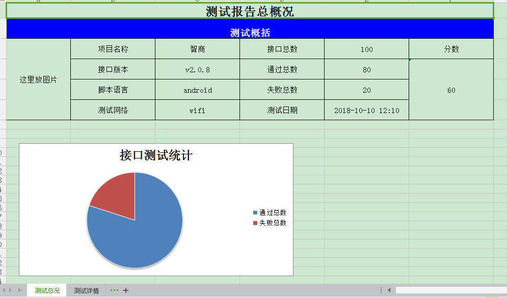

#基于python3实现的http接口自动化测试

##开发环境
* Win7 64，python 3，Pycharm. unittest
* 读取配置文件--读取测试用例--执行测试用例--记录测试结果--生成html结果文件

##框架简介
* 支持常见是HTTP中的post和get方法
* 测试案例驱动用excel管理，注意的地方是为每个案例新增自定义检查函数（更新为了生成器为xml管理）
* 根据需要配置，可以运行部分用例，全部用例
* 测试结合最后生成了html文件，方便查看。


##模块类的设计说明
* Httpbase.py 读取http的域名和端口
* Config.py http方法的封装,可以支持多协议扩展，get,post
* Runner_m.py 核心代码。run_case是程序的入口
* Htmlreport.py 结果生成html文件


##主要更新历史：

###2015-8-3 更新历史
* 自动化接口测试框架完成
* 第三方包：pyh(生成结果html文件), config.ini设置信息  excel管理用例

``` 配置文件
Case_config.ini
[DEFAULT]
index = [1001,1002] 配置运行部分用例id
host = 192.168.1.249
port = 10003
```


###2016-1-5 更新日志
* 更新了使用了requests模块，可以自定义扩展成get,post,put,delete,head,options等方法，同时支持上传图片
* 更新脱离excel来管理测试用例，使用html生成xml接口文件后，给python来解析.

###2016-1-8 更新日志
* 修复了支持指定测试接口测试id

###2016-1-9 更新日志
* 优化在html线生成xml接口，只要填入接口名字，参数，方法，自定义函数就可以了


###2016-1-12 更新日志
* 去掉自动化函数，节省大量代码，只需在接口xml生成器上指定预期结果就可以了

###2016-1-23 更新日志
* 更新了预期结果偶尔无法检测成功的bug
* 更新了需要登陆后的id或者token联合使用接口

###2016-3-22 更新日志
* 优化了检查点。如果实际结果包含了嵌套层，检查点只要检查实际结果中嵌套层的第一个对象。如:data[{"a":b},{"a":"c"}].只要检查{"a":"b"}
 * 一级检查点和二级检查点（嵌套层，只是检查key是否存在）
 * 二级检查主要用的是list set差集的方式 
* 更新了html接口生成器

* 生成器代码参考：https://github.com/284772894/SaveXML

### 2016-7-21

* 代码简单优化了下
* 主要更新了对比规则,第一层对比code的状态，第二层全字段对比，之前想复杂了

```
def compare(exJson,factJson):
    if factJson["appStatus"]["errorCode"] == 0:
       return exJson==factJson
    else:
        print("接口请求失败")
        return False
```


### 2016-7-30 更新日志
* 修改对比规则，如果有嵌套层，首页对比第一层的code,然后对比其他嵌套层的value，不进行其他嵌套层的全字段匹配

```
def compare(exJson,factJson,isList=0):
    isFlag = True
    if exJson.get("appStatus") == factJson.get("appStatus"):
        if isList== False: # 如果没有嵌套层
            return isFlag
        data2 = exJson.get("content")
        data3 = factJson.get("content")
        for item2 in data2:
            for item3 in data3:
                keys2 = item2.keys()
                keys3 = item3.keys()
                if keys2 == keys3: # 如果嵌套层的key完全相等
                     for key in keys2:
                        value2 = item2.get(key)
                        value3 = item3.get(key)
                        if type(value3)==type(value2):# 对比嵌套层的value的type值
                           pass
                        else:
                            isFlag = False
                            break
                else:
                    isFlag = False
                    break
    else:
        isFlag = False
    print(isFlag)
    return isFlag
```

### 2016-8-22 更新日志

* 测试报告改用控制excel的显示方式 




### 2016-8-23 更新日志

* 测试报告以发送邮件的方式通知

### 2016-9-7
* 三层架构重构整个系统

### 2016-9-8
* 新增接口测试扩展
	* 检查参数是否必填
	* 检查参数的值类型是否正确
	
### 2016-9-9 
* 实现检查参数是否必填
* 检查参数的值类型是否正确
* 把http_code的值合并到实际结果

```
  <params>
            <name type="str">account</name> # type=str表示字符类型
            <value>18576759587</value>
            <must>1</must> # 1表示必填，0非必填
        </params>
        <params>
            <name type="str">password</name>
            <value>222222</value>
            <must>1</must>
        </params>
         <params>
            <name type="int">type</name>
            <value>0</value>
            <must>1</must>
        </params>
```


